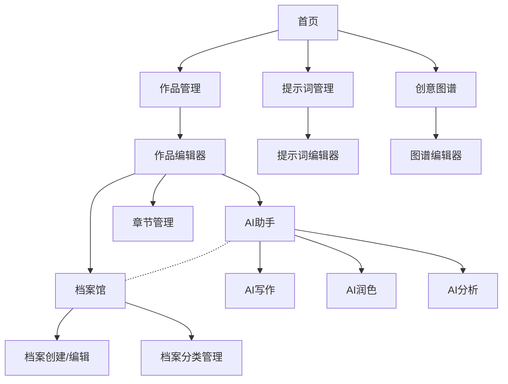

# 烛光写作 - Edge版本

烛光写作是一个使用Next.js构建的在线写作平台，结合现代UI设计和AI功能，帮助作者创作、整理和优化他们的作品。

## Edge版本特点

Edge版本是烛光写作的轻量级版本，主要特点：

- 去除了Supabase依赖，使用本地存储
- 优化了性能，适合在Edge环境下运行
- 简化了部署流程，可以快速部署到Cloudflare Pages等边缘计算平台
- 保留了核心写作和AI辅助功能

## 功能特点

- 美观的用户界面，灵感来源于吉卜力工作室的艺术风格
- 作品管理和编辑器
- 章节管理系统
- AI辅助写作和润色功能
- 档案馆系统用于管理创作素材和设定
- 提示词库管理
- 自动保存功能

## 技术栈

- Next.js 14
- React 18
- TypeScript
- Tailwind CSS
- IndexedDB (通过idb库实现本地存储)
- Zustand (状态管理)
- Gemini API (AI功能)

## 档案馆功能

档案馆系统允许用户创建和管理创作素材、角色设定、世界观等资料，主要特点：

- 创建、编辑和分类档案
- 按分类和标签筛选档案
- 将档案内容直接引用到写作内容中
- 在AI写作时关联档案，使AI更好理解创作背景

## 项目结构

```
/src
  /app - 页面组件
  /components - 可复用UI组件
  /lib - 工具函数和数据操作
  /store - 状态管理
  /types - 类型定义
```

## 应用架构



## 部署说明

Edge版本可以部署到支持Edge运行时的平台，如Cloudflare Pages、Vercel Edge Functions等。部署步骤：

1. 克隆仓库
2. 安装依赖：`npm install`或`yarn`
3. 构建项目：`npm run build`或`yarn build`
4. 部署到Edge平台：`npm run deploy`或使用平台特定的部署命令

## 下一步计划

1. 导出/导入功能
2. 更多AI模型支持
3. 改进创意图谱功能
4. 离线工作模式
5. 完善档案馆功能，支持更丰富的关联和引用
6. 添加用户认证但保持Edge兼容性